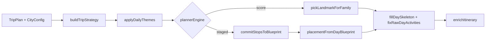

# Staged Planning Engine — Handoff Document

**Audience:** Next AI coding assistant continuing the familyTravely planner redesign.  
**Repo:** `family-travel-planner`  
**Date context:** July 2026  
**Branch note:** Staged engine work is largely **uncommitted** under `src/lib/planning-engine/staged/` plus edits to `src/lib/planning-engine/index.ts` and `types.ts`. Do not confuse with unrelated local Sentry/`package.json` dirty files — leave those alone unless asked.

---

## 1. Product goal

Replace the **global scoring** itinerary builder (repetitive parks, weak interest coverage, budget-as-price-thirds) with a **sequential vacation planner**:

```
Strategy → Themes → Anchor → Support → Meals → Schedule → Validation → AI polish → Enrichment (costs)
```

- Budget & Pace = **styles** compiled into `PlanningRules` (not dollar caps; cost estimated after).
- Scoring only ranks **small valid candidate sets**.
- AI polishes **wording only** after validation.
- Flag: `PLANNER_ENGINE=score|staged` (default **`score`** for safety).

---

## 2. Current architecture

### Live API path (unchanged façade)

```
POST /api/generate-itinerary
  → resolveStayOntoPlan
  → resolvePlanningCity
  → planTrip(plan, { cityOverride, plannerEngine? })
  → normalizeRawItinerary
  → enrichItinerary
  → enrichItineraryTipsWithAi (optional, non-demo)
```

### Inside `planTrip` today

| Step | Always? | Score engine | Staged engine (`plannerEngine: "staged"` or `PLANNER_ENGINE=staged`) |
|------|---------|--------------|---------------------------------------------------------------------|
| `buildTripStrategy` | Yes | Yes (shadow) | Yes |
| `applyDailyThemes` | Yes | Yes (shadow; **anchors null**) | Yes |
| Landmark picks | — | `buildLandmarkContext` → `pickLandmarkForFamily` | `commitStopsToBlueprint` → anchor/support |
| Meals / skeleton fill | Yes | `fillDaySkeleton` | Same glue via `placementFromDayBlueprint` |
| Schedule | Yes | `fixRawDayActivities` | Same (Phase 3 will own this) |
| Enrich / AI | After | Unchanged | Unchanged |

### Pipeline diagram



### Central contract: `TripBlueprint`

Defined in [`src/lib/planning-engine/staged/types.ts`](../src/lib/planning-engine/staged/types.ts):

- `rules: PlanningRules` — compiled budget/pace (paid ratio, meal formality, capacity, naps, convenience)
- `experienceCoverage` — target vs completed per interest tag
- `days[]: DayBlueprint` — `role`, `theme`, `goals[]`, `constraints[]`, `dayBudgetIntent`, `anchor?`, `support[]`, `meals[]`
- `ledger` — used landmark/restaurant names

---

## 3. Staged engine implementation (what exists)

### Core module map (`src/lib/planning-engine/staged/`)

| File | Role | Phase |
|------|------|-------|
| `types.ts` | `TripBlueprint`, `PlanningRules`, `ThemeId`, goals/constraints | 0 |
| `engine-flag.ts` | `resolvePlannerEngine` | 0 |
| `blueprint.ts` | `emptyPlanningRules`, empty shell | 0 |
| `fingerprint.ts` | Golden / compare helpers | 0 |
| `experience-coverage.ts` | Coverage targets + mark completed | 0–1 |
| `strategy-builder.ts` | Roles (arrival/full/departure), baseline goals, rules | 1 |
| `theme-catalog.ts` | Theme ids + goals/constraints templates | 1 |
| `theme-generator.ts` | Theme scoring + assignment | 1 |
| `landmark-experience.ts` | Shoreline beach / play / young-only helpers | 1–2 polish |
| `anchor-selector.ts` | Filter + score + pick day hero | 2 |
| `support-selector.ts` | Nearby complements within capacity | 2 |
| `fill-stops.ts` | `commitStopsToBlueprint`, map to `DayLandmarkContext` | 2 |
| `index.ts` | Public exports | — |

### Wired from

- [`src/lib/planning-engine/index.ts`](../src/lib/planning-engine/index.ts) — orchestration
- [`src/lib/planning-engine/types.ts`](../src/lib/planning-engine/types.ts) — `PlanOptions.plannerEngine`, `PlanTripResult.blueprint`

### Still the “old” engine (reused, not replaced yet)

- `slot-filler.ts` — `fillDaySkeleton`, restaurants
- `skeleton-builder.ts` — day slots
- `meal-planner.ts` / `restaurant-picker.ts` / `meal-timing.ts`
- `schedule/meal-planning.ts`, `fix-itinerary.ts`, `nap-policy.ts`
- `family-profile.ts` — **`pickLandmarkForFamily`** (score path only)
- `pricing/budget-style.ts` — **thirds pools** (score path only; do not use on staged)
- `enrich-itinerary.ts` — can still re-pick landmarks (Phase 4 must stop this)

### Enable staged locally

```env
# .env.local — requires npm run dev restart
PLANNER_ENGINE=staged
```

Or per call: `planTrip(plan, { plannerEngine: "staged", cityOverride })`.

---

## 4. Files changed (this redesign effort)

### New (staged package)

All under `src/lib/planning-engine/staged/` (see table above), including tests:

- `*.test.ts`, `compare-engines.artifact.test.ts` (writes `compare-engines-out.json`)

### Modified

- `src/lib/planning-engine/index.ts`
- `src/lib/planning-engine/types.ts`
- Possibly `src/config/city-pricing.ts` if local retags exist — verify before committing

### Do **not** treat as part of this work

- Sentry scaffolding (`next.config.ts`, `package.json`, `sentry.*`, instrumentation, example pages)
- Scratch outputs: `tsc-*.txt`, `vitest-*.txt`, `compare-out.json`, `nap-check.txt`
- `.cursor/` rules unless intentionally updating

### Architecture plan (Cursor)

- `.cursor/plans/staged_planning_engine_redesign_b7aabd66.plan.md` — locked principles + theme rules

### Comparison artifact

- `compare-engines-out.json` — score vs staged SD 5-day dump (regenerate via artifact test)

---

## 5. Remaining TODOs

| ID | Status | Work |
|----|--------|------|
| Phase 0 contracts | Done | Types, flag, fixtures |
| Phase 1 strategy + themes | Done | Rules, themes, coverage |
| Phase 2 anchor + support | Done | Behind `staged` flag |
| **Phase 3 meals + schedule** | **Next** | Blueprint-owned meals; schedule from committed stops only |
| Phase 4 validation + enrich | Pending | Strong validators; day repair; enrich by ID only |
| Phase 5 cutover | Pending | Default `staged`; quarantine score path |
| Phase 6 AI polish | Pending | Schema-constrained titles/tips |

### Known product gaps (fix before / during Phase 3)

From SD 5-day compare (`compare-engines-out.json`):

1. **Arrival far from stay** — Torrey/La Jolla vs downtown Carlton; soft “near OR flexible outdoor” too loose.
2. **Departure too “big”** — Birch Aquarium as easy-exit anchor.
3. **Play coverage under-filled** — `playgrounds` completed 0/2; no dedicated `play_indoor` day.
4. **Beach anchor quality** — Mission Bay (bay park) vs true shoreline (see `isShorelineBeachExperience`).
5. **Meals unchanged** — still old picker (e.g. Mr. Charlie’s); geo/diet issues not fixed in staged path.
6. **Shadow themes on score path** — score runs still attach themed blueprint without anchors (`anchor: null`) — fine for now; don’t assume score honors themes.

---

## 6. Phase 3 plan (Meals + Schedule on blueprint)

**Goal:** Meals and clocks consume `DayBlueprint` commitments; no POI re-choice.

1. **Meal Planner (staged)**  
   - Read `rules.namedRestaurantMeals`, cook/picnic flags, dietary, nap overlap.  
   - Write `day.meals: MealIntent[]` with restaurant names + modes.  
   - Hard uniqueness + **geo bound** to city (reject cross-city defaults).  
   - Prefer lunch near **anchor** (theme-park / half-day → on-site or near anchor).

2. **Schedule Builder (staged)**  
   - Input: anchor, support, meals, nap windows, capacity.  
   - Output: timed `RawActivity[]` only (reuse timeline math from `meal-planning.ts` / `timeline.ts`).  
   - Drop optional support if dinner window breaks.  
   - Nap notes echo **typed** window.

3. **Wire**  
   - In `buildFullRawStaged`: after `commitStopsToBlueprint` → `planMealsOnBlueprint` → `buildScheduleFromBlueprint` → skip or thin `fillDaySkeleton` / `fixRawDayActivities` for staged.  
   - Keep score path untouched.

4. **Tests**  
   - Vegan SD dinners never invent out-of-city rows.  
   - Staged day: meal near Fleet when interactive anchor is Fleet.  
   - Nap note = typed window.  
   - Regenerate compare artifact.

**Out of scope for Phase 3:** Validation repair loop, AI titles, default cutover.

---

## 7. Important business rules

### Locked design principles

1. Vacations, not attraction lists — purpose first.  
2. Budget = `save|balanced|splurge` → `PlanningRules`, **not** `landmarksForStyle` thirds on staged.  
3. Pace → `rules.capacity` (max activities / support).  
4. Cost estimated **after** structure (enrichment).  
5. AI = polish only, post-validation.  
6. Validation (Phase 4) regenerates **affected day only**.

### Theme rules (approved)

- Catalog ids: `arrival`, `departure`, `beach`, `play_indoor`, `interactive`, `animals` (zoos), `entertainment`, `theme_park`, `nature`, `nature_parks`, `food_market`, `shopping`, `history`, `scenic`, `mixed_family`, `recovery`.  
- Theme score: CoverageNeed 40% · AgeFit 25% · PaceFit 15% · BudgetFit 10% · VarietyBonus 10%.  
- Soft **anchor restrictions**, not hard forbids.  
- Arrival = low friction; Departure = easy exit.  
- Internal theme ids ≠ user-facing day titles.  
- Recovery after high-intensity when pace ≠ relaxed.

### Anchor / support

- Hard trip **ledger** exclusion while unused landmarks remain.  
- Anchor must respect `anchor_primary_tags` / `dayBudgetIntent` when candidates exist.  
- Support within cluster radius; 0 on departure; limited on half-day.  
- Placement: typically support morning → anchor afternoon; half-day theme park → long afternoon.

### Testing strategy (workspace rule)

- Deterministic planner rules → **Vitest**, not Playwright.  
- Report whether Vitest was added and which rule it protects.

---

## 8. Test commands

```bash
# All staged-engine unit tests
npx vitest run src/lib/planning-engine/staged

# Score vs staged JSON artifact → compare-engines-out.json
npx vitest run src/lib/planning-engine/staged/compare-engines.artifact.test.ts

# Broader planning / schedule regressions (score path)
npx vitest run src/lib/schedule src/lib/planning-engine

# Typecheck (CI/Vercel)
npx tsc --noEmit
```

**Dev reload guidance**

- Code under `src/` → usually **reload page** only.  
- Change `PLANNER_ENGINE` / `.env*` → **restart `npm run dev`**.

---

## 9. Known bugs / gaps

| Issue | Severity | Notes |
|-------|----------|--------|
| Arrival/departure geo soft | P1 | Far scenic picks on arrival; aquarium on departure |
| Play interest under-served | P1 | Coverage completed stays 0 without `play_indoor` day |
| Beach = bay park | P1 | Prefer `isShorelineBeachExperience` for beach anchors |
| Meals still score-path | P1 | Phase 3; Mr. Charlie’s / dietary geo |
| Enrich may re-pick landmarks | P1 | Phase 4 |
| Staged not default | — | Intentional until Phase 5 |
| Score path builds unused themes | Low | Shadow only; don’t document as “score uses themes” |
| Uncommitted staged package | Process | Commit staged files separately from Sentry noise |

---

## 10. Review answers (for the next assistant)

### 1) Which files are the core engine files?

**Staged core (touch carefully, own the redesign):**

- `src/lib/planning-engine/staged/types.ts`
- `src/lib/planning-engine/staged/strategy-builder.ts`
- `src/lib/planning-engine/staged/theme-catalog.ts`
- `src/lib/planning-engine/staged/theme-generator.ts`
- `src/lib/planning-engine/staged/experience-coverage.ts`
- `src/lib/planning-engine/staged/anchor-selector.ts`
- `src/lib/planning-engine/staged/support-selector.ts`
- `src/lib/planning-engine/staged/fill-stops.ts`
- `src/lib/planning-engine/staged/landmark-experience.ts`
- `src/lib/planning-engine/index.ts` (orchestration / flag branch)

**Legacy still on critical path for staged meals/schedule until Phase 3:**

- `slot-filler.ts`, `skeleton-builder.ts`, `meal-planner.ts`, `restaurant-picker.ts`, `schedule/fix-itinerary.ts`, `schedule/meal-planning.ts`

### 2) Which files should never be modified casually?

| File / area | Why |
|-------------|-----|
| `staged/types.ts` | Contract; bumps `TRIP_BLUEPRINT_VERSION`; breaks all stages |
| `staged/theme-catalog.ts` | Approved product theme semantics |
| `interest-map.ts` | Wizard label → tags; silent coverage bugs |
| `config/city-pricing.ts` landmark tags/prices | Catalog truth; retags change every trip |
| `config/city-restaurants.ts` | Dietary/geo; user-reported bad pins |
| `planTrip` score branch in `index.ts` | Production default; regressions hit all users |
| `enrich-itinerary.ts` re-pick logic | Easy to drift titles vs blueprint |
| API route contract / `TripPlan` shape | Client + demo compatibility |

Prefer **additive** staged modules over editing score-path scoring in `family-profile.ts` unless fixing a shared bug.

### 3) Safest next implementation order

1. **Tighten Phase 2 quality (small, flagged)** before Phase 3: shoreline beach anchors, arrival stay radius, departure soft picks, ensure a `play_indoor` day when that interest is selected — all behind `staged` only.  
2. **Phase 3a — Meal intents on blueprint** (write `day.meals`, geo-safe restaurants); keep `fillDaySkeleton` temporarily reading those intents if easier.  
3. **Phase 3b — Schedule from blueprint** (replace staged use of ad-hoc skeleton timing).  
4. **Regenerate compare artifact** + Vitest for meals/coverage.  
5. **Phase 4 — Validation + day repair** + kill enrich re-pick.  
6. **Phase 5 — Default staged** only after compare/fixtures look good.  
7. **Phase 6 — AI display titles** (“Ocean Adventure Day”) from internal theme ids.

Do **not** flip default to `staged` or delete `pickLandmarkForFamily` until Phase 4–5.

---

## 11. Quick start for the next agent

```text
1. Read this handoff + .cursor/plans/staged_planning_engine_redesign_b7aabd66.plan.md
2. Run: npx vitest run src/lib/planning-engine/staged
3. Run compare artifact; open compare-engines-out.json
4. Implement Phase 3 (or Phase 2 polish) per order above
5. Keep PLANNER_ENGINE default = score
6. Add Vitest for every deterministic rule change
7. Tell the user: restart vs reload when env/code changes
```

**Vitest report convention (workspace rule):** After implementation, state whether a Vitest test was added, why, and which business rule it protects.
